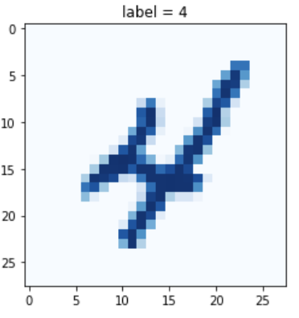
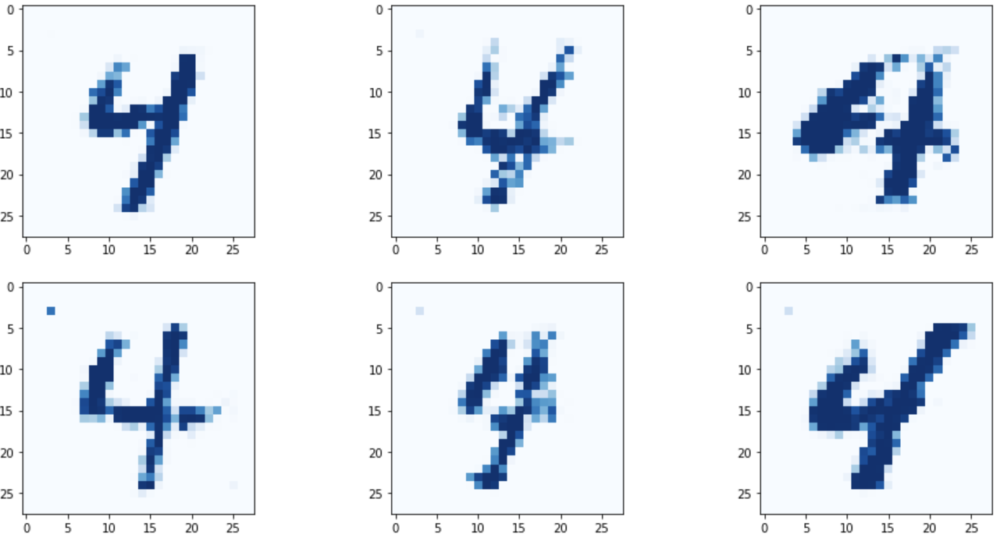
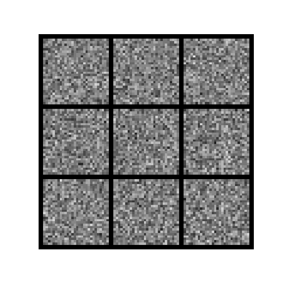
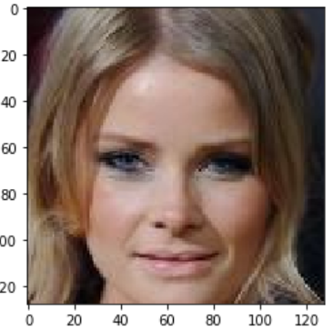
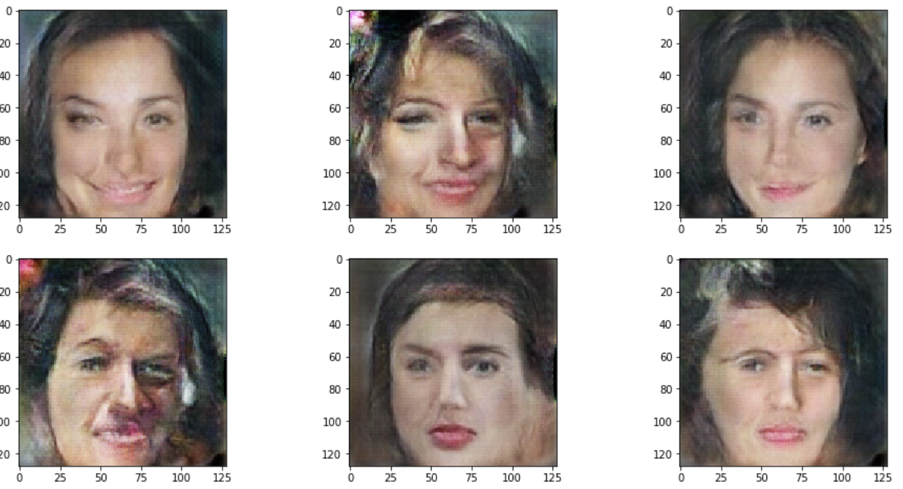

# GANs-Generative-Adversarial-Networks
Samples for Generative Adversarial Networks

## Frameworks
Pytorch 1.8.1 + CUDA 11.1    
Jupyter Notebook 
Pandas  
Numpy  
TQDM (Progressbar)  
Matplotlib

### Prepare Environment
Download MNIST Dataset and place it in ./dataset/mnist/

[MNIST: Trainingset - https://pjreddie.com/media/files/mnist_train.csv](https://pjreddie.com/media/files/mnist_train.csv)  
[MNIST: Testset - https://pjreddie.com/media/files/mnist_test.csv](https://pjreddie.com/media/files/mnist_test.csv)

*Directory should look like this*
```
./dataset  
    /mnist  
        mnist_test.csv  
        mnist_train.csv
```

## Project description
### MNIST GAN
Train a discriminator and generator to produce handwritten numbers similar to the MNIST dataset.

Example image from MNIST Dataset.  


Numbers generated by neural network:  


Training progress :  


#### Jupyter Notebook
`jupyter notebook "MNIST GAN.ipynb"`

### CalebA GAN
Train a discriminator and generator to produce human faces similar to the CalebA dataset.

Example image from MNIST Dataset.  


Faces generated by neural network:  


#### Jupyter Notebook
`jupyter notebook "CalebA GAN.ipynb"`

